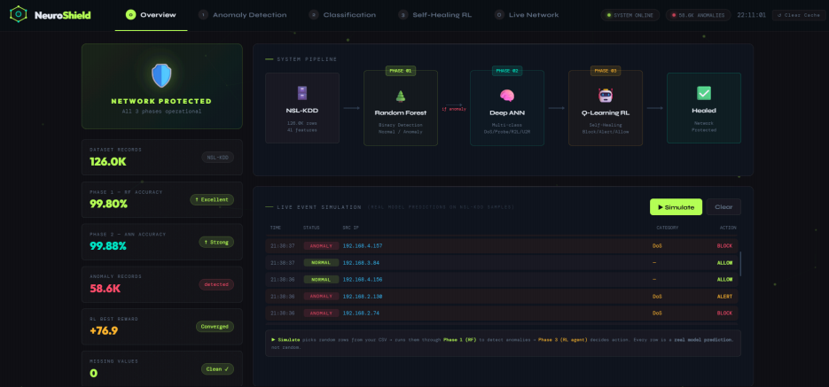
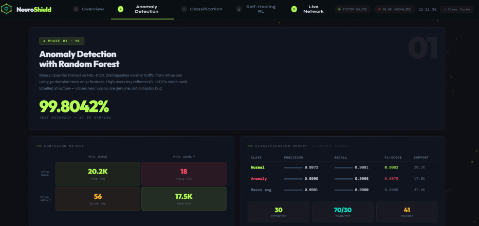
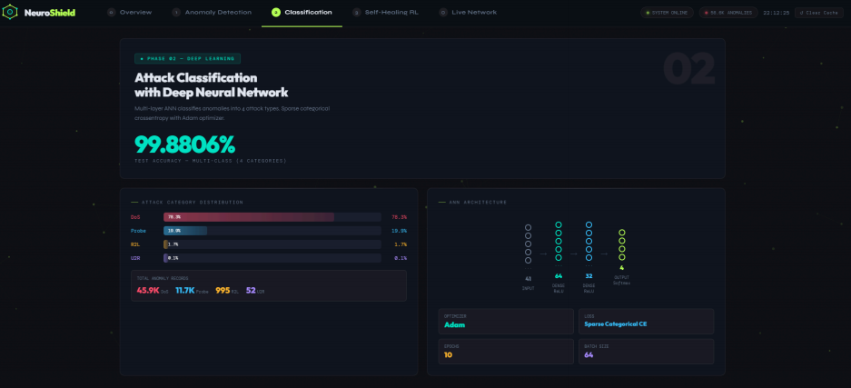
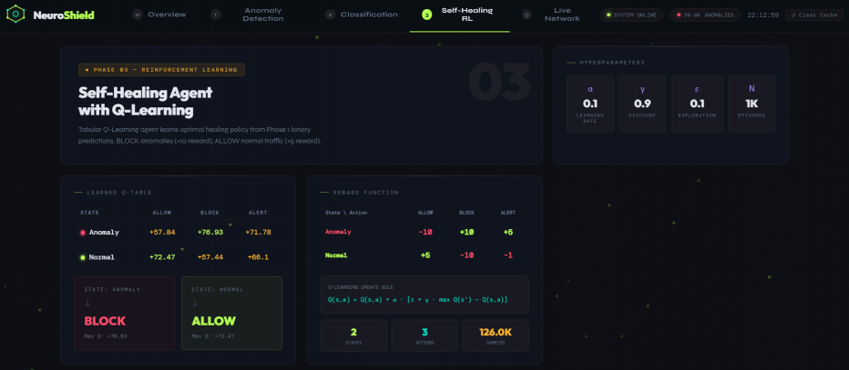
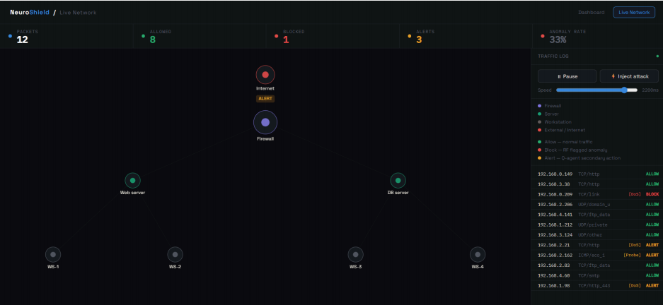
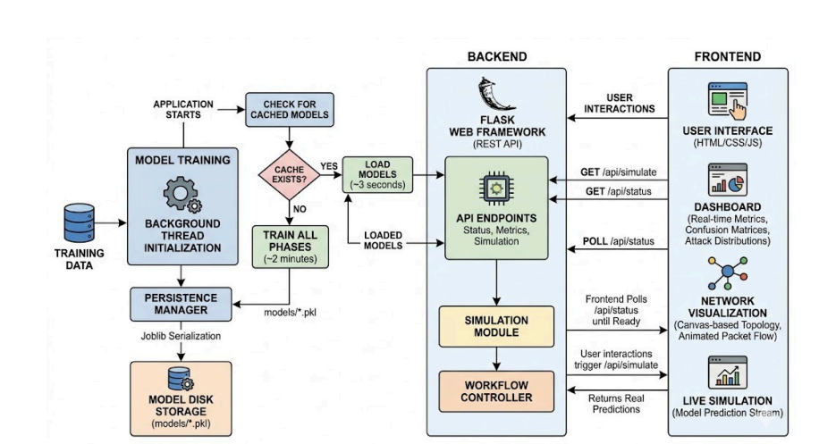

# 🛡️ NeuroShield – Autonomous Self-Healing Network Intrusion Detection System

> An AI-powered Network Intrusion Detection System that combines **Random Forest**, **Deep Neural Networks**, and **Q-Learning** to detect cyber attacks and automatically recommend self-healing actions.


---

# 📷 Dashboard Overview



---

# 📌 Overview

NeuroShield is an intelligent Intrusion Detection System (IDS) developed to enhance network security using Machine Learning, Deep Learning, and Reinforcement Learning.

The system analyzes network traffic from the **NSL-KDD dataset**, detects malicious activities using a **Random Forest classifier**, classifies attacks using an **Artificial Neural Network (ANN)**, and applies **Q-Learning** to recommend autonomous response actions such as **Allow**, **Alert**, or **Block**.

An interactive Flask dashboard provides real-time visualization of predictions, attack statistics, and the autonomous self-healing workflow.

---

# ✨ Features

- 🛡️ Network Intrusion Detection
- 🌲 Random Forest-based anomaly detection
- 🧠 Deep Neural Network attack classification
- 🤖 Q-Learning autonomous response engine
- 📊 Interactive Flask dashboard
- 📈 Real-time attack prediction
- 🚨 Automated response recommendation
- 📉 Confusion matrix and performance metrics
- 🔒 Self-healing security workflow

---

# 🛠️ Tech Stack

| Technology | Purpose |
|------------|---------|
| Python | Programming Language |
| Flask | Backend Framework |
| HTML | Frontend |
| CSS | Styling |
| Bootstrap | User Interface |
| Random Forest | Binary Intrusion Detection |
| Artificial Neural Network | Multi-class Attack Classification |
| Q-Learning | Autonomous Self-Healing |
| Scikit-learn | Machine Learning |
| TensorFlow / Keras | Deep Learning |
| Pandas | Data Processing |
| NumPy | Numerical Computing |
| NSL-KDD | Network Dataset |

---

# 🏗️ System Workflow

```text
Network Traffic
        │
        ▼
Feature Extraction
        │
        ▼
Random Forest
(Anomaly Detection)
        │
        ▼
Artificial Neural Network
(Attack Classification)
        │
        ▼
Q-Learning
(Self-Healing Decision)
        │
        ▼
Flask Dashboard
```

---

# 📂 Project Structure

```text
NeuroShield/
│
├── app.py
├── nsl_kdd_loader.py
├── phase1_anomaly_rf.py
├── phase2_dl.py
├── phase3_rl.py
├── templates/
├── screenshots/
└── README.md
```

---

# 🚀 Installation

### Clone Repository

```bash
git clone https://github.com/Ishwari345/NeuroShield.git
```

### Install Dependencies

```bash
pip install -r requirements.txt
```

### Run the Application

```bash
python app.py
```

Open your browser:

```
http://localhost:5000
```

---

# 📷 Project Screenshots

## Random Forest Anomaly Detection

Binary anomaly detection using Random Forest with confusion matrix and performance metrics.



---

## Deep Neural Network Attack Classification

Multi-class attack classification using an Artificial Neural Network.



---

## Q-Learning Self-Healing Agent

Reinforcement learning dashboard showing reward matrix and learned policy.



---

## Live Network Simulation

Real-time visualization of packets with automated Allow, Alert, and Block actions.



---

## System Architecture

Overall architecture illustrating the interaction between the frontend, backend, and AI models.



---

# 🎯 Applications

- Network Intrusion Detection
- Cybersecurity Research
- AI-based Threat Detection
- Self-Healing Networks
- Educational AI Project

---

# 🔒 Advantages

- Hybrid ML + DL + RL architecture
- Intelligent attack detection
- Autonomous response recommendation
- Interactive dashboard
- Easy to extend with new datasets

---

# 🔮 Future Enhancements

- Live packet capture
- Cloud deployment
- User authentication
- Email & SMS alerts
- SIEM integration
- Support for additional IDS datasets

---

# 👩‍💻 Author

**Ishwari Bagewadi**

Information Science Engineering Student

---

# 🙏 Acknowledgements

- Scikit-learn
- TensorFlow
- Flask
- Bootstrap
- NSL-KDD Dataset
- Open Source Community
